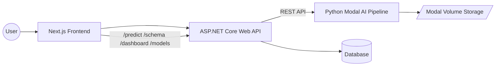

# Agentic AI System

A complete, production-ready **Agentic AI platform** combining:

- **Next.js Frontend**
- **ASP.NET Core Backend**
- **Python AI/ML Pipeline deployed on Modal**
- **Database layer with ERD + Mapping**

This README documents the entire system architecture and how each layer interacts.

---

## 🏗️ System Architecture Overview



---

# 1. Frontend (Next.js)

The frontend handles authentication, dataset upload, prediction, dashboard visualization, and model reporting.

### ✨ Key Pages
| Page | Description |
|------|-------------|
| `/upload` | Upload dataset file + target selection |
| `/predict` | Dynamic form built from /schema API |
| `/dashboard` | Visualizations generated by the AI pipeline |
| `/report` | Best model summary, metrics, markdown report |

### Dashboard Rendering Logic

The dashboard page receives an AI‑generated JSON object containing:
- Missing data analysis  
- Column summaries  
- Feature distributions  
- Correlation heatmaps  
- LLM‑planned charts (exactly 6 rendered charts)  

Frontend simply **renders** these pre‑built chart instructions.

---

# 2. Backend (ASP.NET Core API)

The backend acts as the coordinator between frontend and AI pipeline.

### 📌 Key Responsibilities
- User authentication  
- Dataset record creation  
- Forwarding requests to Modal AI functions  
- Storing summary responses  

---

# 3. Database Layer

### ERD (Simplified)

```
ApplicationUser
    ID (PK)
    UserName
    Email
    Password
    CreatedAt

DatasetRecord
    ID (PK)
    FileName
    FilePath
    UploadedAt
    UserId (FK)
    TargetColumn
    RunAutoML
    AIResponseJson
```

---

# 4. AI System (Python + Modal)

The AI backend is a **multi-agent pipeline** deployed on Modal. It includes:

### Pipeline Stages
1. **Ingestion Agent** – Loads CSV/Excel/JSON  
2. **Preprocessing Agent** – Cleans, validates, types columns  
3. **Feature Engineering Agent** – Encoding, PCA, polynomial, interactions, SMOTE  
4. **Model Training Agent** – Trains 3–7 models and picks the best  
5. **Visualization Agent** – Generates dashboard JSON (charts)  
6. **Auto AI Agent** – Orchestrates entire AutoML flow + LLM reasoning  

### Dashboard Generation

The dashboard includes:
- Missing-value heatmaps  
- Summary statistics  
- Histograms & bar charts  
- Correlation matrices  
- LLM‑designed chart layout (6 charts max)  
- Transformed into **ready-to-plot JSON** for the frontend  

---

# 5. Prediction Pipeline

Prediction automatically:
1. Loads proper model version  
2. Reconstructs feature engineering  
3. Sanitizes columns  
4. Runs model inference  
5. Decodes classification labels if needed  


---

# 6. Folder Structure

```
root/
│
├── frontend/
├── backend/
├── ai/
│   ├── pipeline/
│   └── modal_app.py
└── docs/
```

---

# 7. Running the Project

### Backend
```bash
cd backend
dotnet restore
dotnet run
```

### Frontend
```bash
cd frontend
npm install
npm run dev
```

### Modal AI Pipeline
```bash
cd ai
modal deploy modal_app.py
```

---

# 8. API Overview 

Here is the **FULL REST API** used by the system.

---

## 📁 Dataset APIs

### **POST /Dataset/upload**
Uploads file, selects target, initializes AI pipeline.

---

### **GET /Dataset/schema/{user_id}/{version}**
Returns dynamic input schema for prediction UI.

Response includes:
- Column types  
- Allowed numeric ranges  
- Raw categorical label options  
- Target column  

---

## 📊 Dashboard API

### **GET /Dataset/dashboard/{user_id}/{version}**

Returns full dashboard JSON produced by the AI visualization agent, including:

- Missing-value analysis  
- Column summaries  
- Correlation heatmaps  
- LLM-generated chart plan  
- Ready-to-plot chart definitions  

This is what powers the `/dashboard` page.

---

## 🤖 Models Summary API

### **GET /Dataset/models/{user_id}/{version}**

Returns:
- Best model name  
- Metrics for all trained models  
- Generalization gap  
- Stored markdown AutoML report  
- Version information  

Used by `/report` page.

---

## 🔮 Prediction API

### **POST /predict**

Body:
```json
{
  "user_id": "123",
  "version": 1,
  "model_name": null,
  "features": { ... }
}
```

Response:
```json
{
  "prediction": ...,
  "model_used": "...",
  "confidence": 0.92,
  "processing_time_ms": 34.5
}
```

---

# 9. AutoML Report

The system generates a full Markdown report including:
- Data summary  
- Preprocessing reasoning  
- Feature engineering logic  
- Model comparison table  
- Best model explanation  

Stored at:
```
/root/data/users/<id>/reports/report_vX.md
```

---

# 10. Key Features

- Fully automated ML pipeline  
- Agent-driven configuration (LLM-powered)  
- Parallel model training  
- Versioned datasets and models  
- Dynamic schema → dynamic prediction UI  
- Full AutoML markdown reporting  
- AI-generated dashboards  

---

# 11. Future Enhancements

- Drift detection  
- Automated retraining loop   
- Improved Dashboard UI  

